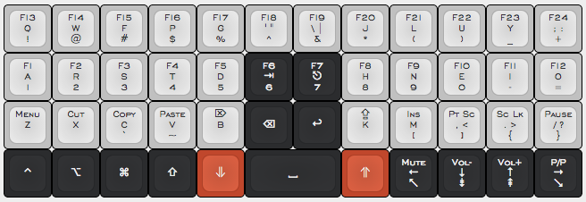
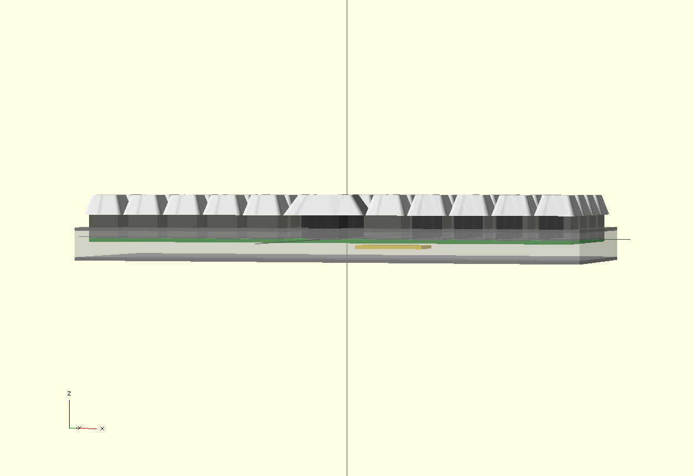

# Planck keyboard

## Mappings

### "Classic"

### Jack's

### "Ergolemak"

## 3D previews

## Resources

- OpenSCAD preview in [cases/3d/metal.scad](shapes.scad), rendered in [img/render/](img/render/)
- [Spreadsheet](https://docs.google.com/spreadsheets/d/16PL8BpmRk11sDVm4-0jr7IXSfV37S0lgZxZrVKjS4J4/) with multiple tabs, covering:
  - Alternative 4th line layouts (available on PCB)
  - Layout comparison with the HHKB and Poker 2
  - Dimensions
  - Pierre's orders
- [Idea progression](https://imgur.com/a/I05MD)

## Contributors

- Jack Humbert
- Pierre Carrier
