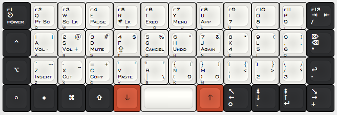

Planck keyboard
===============

[](http://www.keyboard-layout-editor.com/##@@_c=%232b2c2e&t=%23ffffff&p=DSA%3B&=f1%0Apower%0A%0A%0A%0A%0A%E2%8E%8B&_c=%23e8e7e3&t=%23000000&a:0%3B&=f2%0APt%20Sc%0A%0A%0AQ%0A%0AQ&=f3%0ASc%20Lk%0A%0A%0AW%0A%0AW&_a:4%3B&=f4%0APause%0A%0A%0AF%0A%0AE&=f5%0A%23%20Lk%0A%0A%0AP%0A%0AR&=f6%0AExec%0A%0A%0AG%0A%0AT&=f7%0AMenu%0A%0A%0AJ%0A%0AY&_a:0%3B&=f8%0AApp%0A%0A%0AL%0A%0AU&=f9%0A7%0A%0A%0AU%0A%0AI&=f10%0A8%0A%0A%0AY%0A%0AO&_h2:0.75%3B&=f11%0A9%0A%0A%0A%2F%3B%0A%2F:%0AP&_c=%232b2c2e&t=%23ffffff&a:4%3B&=f12%0A%2F%2F%0A%0A%0A%0A%0A%E2%87%A5%0A%E2%87%A4%3B&@_a:7%3B&=%E2%8C%83%0Apower%0A%0A%0A%0A%0A%E2%8E%8B&_c=%23e8e7e3&t=%23000000&a:0%3B&=1%0AVol%20-%0A!%0A%0AA%0A%0AA&=2%0AVol%20+%0A%2F@%0A%0AR%0A%0AS&=3%0AMute%0A%23%0A%0AS%0A%0AD&=4%0A%E2%87%AA%0A$%0A%0AT%0A%0AF&=5%0ACancel%0A%25%0A%0AD%0A%0AG&=6%0AUndo%0A%5E%0A%0AH%0A%0AH&=7%0AAgain%0A%2F&%0A%0AN%0A%0AJ&=8%0A4%0A*%0A%0AE%0A%0AK&=9%0A5%0A(%0A%0AI%0A%0AL&=0%0A6%0A)%0A%0AO%0A%0A%2F%3B%0A%2F:&_c=%232b2c2e&t=%23ffffff&a:4%3B&=%E2%8C%A6%0A*%0A%0A%0A%0A%0A%E2%8C%AB%3B&@_a:7%3B&=%E2%8C%A5%0Apower%0A%0A%0A%0A%0A%E2%8E%8B&_c=%23e8e7e3&t=%23000000&a:0%3B&=%60%0AInsert%0A~%0A%0AZ%0A%0AZ&=-%0ACut%0A%2F_%0A%0AX%0A%0AX&=%2F=%0ACopy%0A+%0A%0AC%0A%0AC&='%0APaste%0A%22%0A%0AV%0A%0AV&=%22%0A%7C%0A'%0A%5C%0AB%0A%0AB&=%7B%0A(%0A%5B%0A9%0AK%0A%0AN&=%7D%0A)%0A%5D%0A0%0AM%0A%0AM&=%5B%0A1%0A%7B%0A%0A,%0A%3C%0A,%0A%3C&=%5D%0A2%0A%7D%0A%0A.%0A%3E%0A.%0A%3E&=%5C%0A3%0A%2F%2F%0A%0A%2F%2F%0A%3F%0A%2F%2F%0A%3F&_c=%232b2c2e&t=%23ffffff&a:4%3B&=%0A-%0A%0A%0A%0A%0A%E2%86%A9%3B&@_a:7%3B&=%E2%97%8B&=%E2%97%86%0Apt%20sc%0A%0A%0A%0A%0Aq&=%E2%8C%98%0Asc%20lk%0A%0A%0A%0A%0Aw&=%E2%87%A7%0Apause%0A%0A%0A%0A%0Ae&_c=%23c0472c&t=%23000000%3B&=%E2%A5%A5%0Anum%20lk%0A%0A%0A%0A%0Ar&_c=%23e8e7e3&p=DSA%20SPACE&a:4&w:2%3B&=&_c=%23c0472c&p=DSA&a:7%3B&=%E2%A5%A3%0Aapp%0A%0A%0A%0A%0Au&_c=%232b2c2e&t=%23ffffff&a:4%3B&=%E2%86%96%0A0%0A%0A%0A%0A%0A%E2%86%90&=%E2%87%9F%0A.%0A%0A%0A%0A%0A%E2%86%93&=%E2%87%9E%0A%E2%86%B5%0A%0A%0A%0A%0A%E2%86%91&=%E2%86%98%0A+%0A%0A%0A%0A%0A%E2%86%92)

Resources
---------
- OpenSCAD preview in [shapes.scad](shapes.scad)
- Rendered in [render](render/)
- [Spreadsheet](https://docs.google.com/spreadsheets/d/16PL8BpmRk11sDVm4-0jr7IXSfV37S0lgZxZrVKjS4J4/)
  - Layout comparison with the HHKB
  - Alt 4th line layouts
  - Key mappings for QWERTY and Colemak
  - Dimensions
  - Pierre's orders
- [Idea progression](https://imgur.com/a/I05MD)

Contributors
------------
- Jack Humbert
- Pierre Carrier
